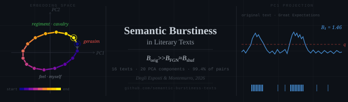

<!-- # Semantic Burstiness in Literary Texts -->

Code and data for:

> M. Degli Esposti, M. A. Montemurro  
> **Semantic burstiness reveals the topical origin of long-range correlations in texts**  
> *Proceedings of the National Academy of Sciences*, 2026 (submitted)

## Overview

We map literary texts to word-embedding trajectories (GloVe 6B, 300d), apply PCA to
identify the dominant semantic directions, and measure the **burstiness** of
threshold-crossing events along each direction. Original texts are compared with two
null models — word-shuffled surrogates and FGN surrogates (Degli Esposti & Montemurro,
*Physica A*, 2025), which preserve the word frequencies and match the DFA scaling
exponent of the original — and semantic burstiness turns out to be a property of the
text that neither null reproduces.

**Central result:**
$B_k^{\rm orig} \gg B_k^{\rm FGN} \approx B_k^{\rm shuf}$
across 16 texts and 20 PCA components, robust for all quantile thresholds
$q \in [0.60, 0.99]$.

## Repository structure

```
semantic-burstiness-texts/
├── src/semburst/         Python package: text, embed, pca, burst, surrogates, dfa, acf, pipeline, figures
├── scripts/
│   ├── run_corpus.py     regenerates the three corpus tables (~40 s on a laptop CPU)
│   ├── run_text.py       per-text figures
│   ├── compare_reference.py
│   └── check_*.py        validation scripts (see note/)
├── data/corpus/          16 Project Gutenberg texts
├── results/
│   ├── corpus_burstiness.csv, corpus_acf.csv, corpus_dfa.csv
│   ├── reference/        tables produced by the original Colab notebook (frozen)
│   └── validation_*.txt, compare_reference.txt, run_corpus.log
├── figures/<stem>/       per-text figures used in the paper
├── note/                 pipeline description, design choices, validation report
├── notebooks/            the original Colab notebook (archived, no longer maintained)
└── paper/                LaTeX source
```

## Installation

```bash
conda create -n semburst python=3.11 && conda activate semburst
pip install -e .
```

Dependencies (from `pyproject.toml`): numpy, scipy, scikit-learn, pandas, matplotlib,
gensim, nltk==3.9.1 (pinned: the tokeniser changed in 3.10). NLTK's `punkt` data is
downloaded automatically on first use. No GPU is needed.

## Word vectors

Download `glove.6B.zip` from https://nlp.stanford.edu/projects/glove/ and place
`glove.6B.300d.txt` in `data/vectors/`. The file is fingerprinted on first load
(SHA-256 `91125602f730fea7ca768736c6f442e668b49db095682bf2aad375db061c21ed`) and a gensim
`.kv` cache is written next to it.

## Reproducing the results

```bash
python scripts/run_corpus.py data/corpus                      # results/corpus_*.csv
python scripts/run_text.py data/corpus/eng_wrnpc.txt \
                           data/corpus/great_expectations_cut_clean.txt   # figures/<stem>/
python scripts/compare_reference.py                           # against results/reference/
```

The pipeline is deterministic (fixed seeds) and the tables are reproduced identically
across macOS/arm64 and Linux/x86-64. See `note/pipeline_and_validation.md` for the
description of the pipeline, the choices made when the notebook was replaced, and the
validation against the original results.

## Corpus

16 English literary texts from Project Gutenberg (public domain), in `data/corpus/`.
Token counts and DFA exponents are in `results/corpus_burstiness.csv`.

## FGN surrogate

The construction follows

> M. Degli Esposti, M. A. Montemurro  
> *A Zipf-preserving, long-range correlated surrogate for written language and other
> symbolic sequences*, Physica A, 2025

and is implemented in `src/semburst/surrogates.py`.

## Citation

```bibtex
@article{DegliEspostiMontemurro2026,
  author  = {Degli Esposti, Mirko and Montemurro, Marcelo A.},
  title   = {Semantic burstiness reveals the topical origin of
             long-range correlations in texts},
  journal = {Proceedings of the National Academy of Sciences},
  year    = {2026},
  note    = {submitted}
}
```

## License

Code: [MIT License](LICENSE).  
Texts: public domain (Project Gutenberg).  
GloVe vectors: see [Stanford NLP licence](https://nlp.stanford.edu/projects/glove/).
